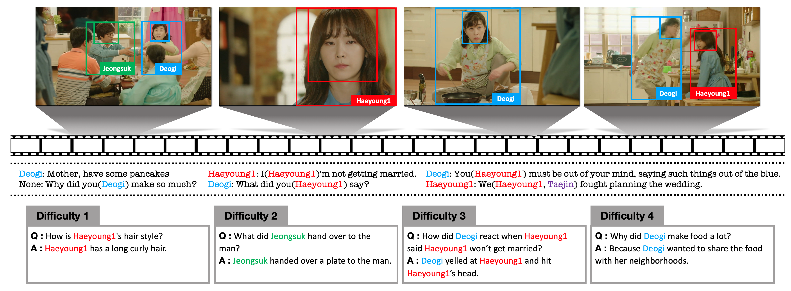
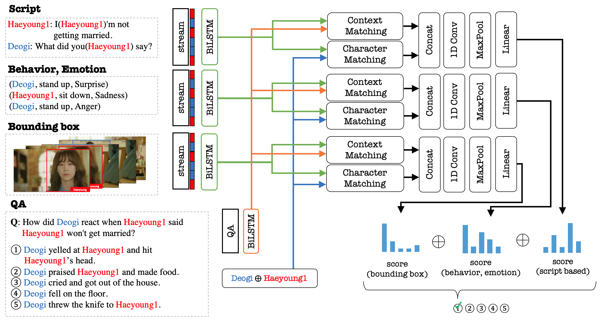

# DramaQA Starter Code
<!--
This repository contains pipelines to conduct video QA with deep learning based models.
It supports image loading, feature extraction, feature caching, training framework, tensorboard logging and more.
-->

## Dataset
DramaQA dataset is built upon the TV drama `Another Miss Oh` and it contains 16,191 QA pairs from 23,928 various length video clips, with each QA pair belonging to one of four difficulty levels. We provide 217,308 annotated images with rich character-centered visual annotations and coreference resolved scripts. 

- Dataset Overview
    

## Dual Matching Multistream
Dual Matching Multistream model effectively learns character-centered representations of video to answer questions about the video.

- Model Overview
    


## Dependency

We use python3 (3.5.2), and python2 is not supported.
We use PyTorch (1.1.0), though tensorflow-gpu is necessary to launch tensorboard.

python packages:
[fire](https://github.com/google/python-fire) for commandline api


## Install

```bash
git clone --recurse-submodules (this repo)
cd $REPO_NAME/code
(use python >= 3.5)
pip install -r requirements.txt
python -m nltk.downloader 'punkt'
```
Place the data folder at `$REPO_NAME/data`.


## Data Folder Structure
Download DramaQA dataset from [here](https://dramaqa.snu.ac.kr/Download) and place the data folder like following structure. 
```
code/
  cli.py
  train.py
  evaluate.py
  infer.py
  ...
data/
  AnotherMissOh/
    AnotherMissOh_images/
      $IMAGE_FOLDERS
    AnotherMissOh_QA/
      AnotherMissOhQA_train_set.json
      AnotherMissOhQA_val_set.json
      AnotherMissOhQA_test_set.json
    AnotherMissOh_Visual.json
    AnotherMissOh_script.json
```


## How to Use

### Training

```bash
cd code
python cli.py train
```

The above command will preprocess textual and visual input before it starts training process. Access the prompted tensorboard port to view basic statistics.
At the end of every epoch, a checkpoint file will be saved on `data/ckpt/OPTION_NAMES`

For further configurations, take a look at `code/config.py` and
[fire](https://github.com/google/python-fire).

### Evaluation

```bash
cd code
python cli.py evaluate --ckpt_name=$CKPT_NAME
```

Substitute CKPT_NAME to your prefered checkpoint file.
e\.g\. `--ckpt_name=model_name_dmm_ckpt_3/loss_0.4818_epoch_15`

### Making submissions
Challenge participants should submit their outcome with this command.

```bash
python cli.py infer --ckpt_name=$CKPT_NAME
```

The above command will save the outcome at the prompted location. 
<!-- To get answers from validation data split, change `--split test` to `--split val`. -->

<!--
### Evaluating submissions

```bash
cd code/scripts
python eval_submission.py -y $SUBMISSION_PATH -g $DATA_PATH
```
-->

<!--
### Default Preprocessing Details

- images are resized to 224X224 for preprocessing (resnet input size)
- using last layer of resnet50 for feature extraction (base behaviour)
- using glove.6B.300d for pretrained word embedding
- storing image feature cache after feature extraction (for faster dataloading)
- using nltk.word_tokenize for tokenization
- all images for a scene questions are concatenated in a temporal order
-->
## Troubleshooting

See the Troubleshooting page and submit a new issue or contact us if you cannot find an answer.

## Contact Us

To contact us, send an email to shchoi@bi.snu.ac.kr